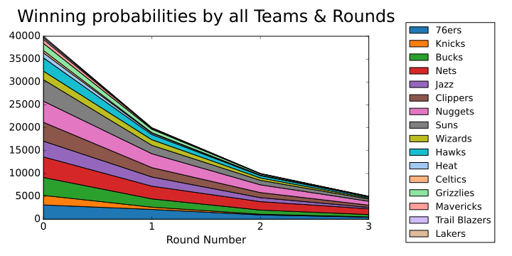
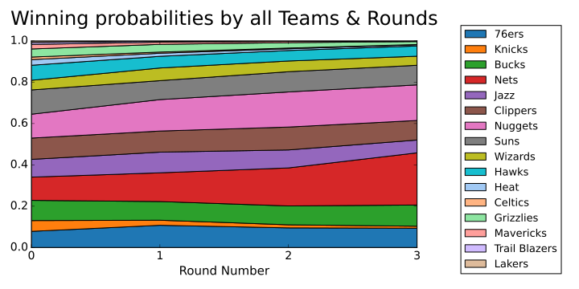

# NBA_SVM

using SVM to predict the NBA champion.

## 2019-2020 NBA predict chanmpion

### Figure

### Predict result

|Team ID |  The final round winning probabilities |
|:-:| :-:|
| Nets |  0.2530 |
| Nuggets  |0.1726 |
| Bucks |  0.1040 |
| 76ers |   0.1030 |
| Clippers  | 0.0944 |

### Compare

| type | winner |  
| :-: | :-:|
| 模型预测结果 | Nets > Nuggets > Bucks |  
| 实际结果 | Bucks |
